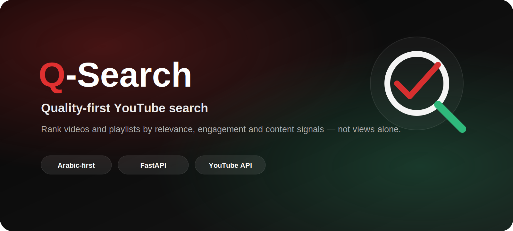
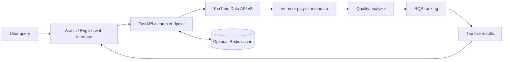

<p align="center">
  
</p>

<p align="center">
  <a href="https://q-search-77si.onrender.com"></a>
  <a href="https://github.com/abdulrahman-517/q-search"></a>
</p>

<p align="center">
  
  
  
  
  
</p>

## Overview

**Q-Search** is an Arabic-first search interface for discovering YouTube videos and playlists by estimated content quality rather than view count alone.

The backend retrieves candidate results through the YouTube Data API, analyzes several relevance and engagement signals, calculates a **Real Quality Score (RQS)**, then returns the five strongest matches. The interface supports Arabic and English and works across desktop and mobile layouts.

> RQS is a project-specific heuristic, not an objective or official measure of video quality.

## Why Q-Search?

Conventional search ranking can overemphasize popularity. Q-Search explores a different question:

> Which results appear most useful for this query when relevance, engagement quality, duration, comments, and clickbait signals are considered together?

## Key Capabilities

| Capability | Description |
|---|---|
| Quality-first ranking | Re-ranks candidate results using the project's multi-factor RQS model |
| Videos and playlists | Supports automatic, video-only, and playlist-only search modes |
| Arabic-first interface | Native RTL experience with an English language toggle |
| Focused result set | Returns only the top five qualifying results |
| Comment analysis | Uses comment text as one signal in the ranking process |
| Responsive UI | Designed for mobile, tablet, and desktop |
| Optional caching | Supports Redis to reduce repeated upstream API requests |
| Health endpoint | Exposes a lightweight service-health response at `/health` |

## Ranking Model

The current score combines the following weighted signals:

| Weight | Signal |
|---:|---|
| 30% | Like-to-view ratio |
| 25% | Estimated value of comment content |
| 15% | Title and search-query keyword match |
| 10% | Comment sentiment |
| 10% | Duration score |
| 10% | Quality adjustments, including clickbait penalty and educational boost |

The weights are configurable design decisions and may evolve as the project is tested against more queries.

## Architecture



## Technology Stack

| Layer | Technology |
|---|---|
| API | Python, FastAPI, Pydantic |
| Data retrieval | YouTube Data API v3, HTTPX |
| Analysis | TextBlob, VADER Sentiment, NLTK |
| Cache | Redis (optional) |
| Frontend | HTML, CSS, Vanilla JavaScript |
| Interface | Arabic RTL with English toggle |
| Server | Uvicorn |
| Hosting | Render |

## Project Structure

```text
q-search/
├── main.py                 # FastAPI application and endpoints
├── config.py               # Environment-based configuration
├── data_fetcher.py         # YouTube API data retrieval
├── quality_analyzer.py     # Ranking and scoring logic
├── models.py               # Pydantic request/response models
├── static/
│   └── index.html          # Responsive Arabic/English interface
├── requirements.txt
├── .env.example
└── .gitignore
```

## Local Setup

### 1. Clone the repository

```bash
git clone https://github.com/abdulrahman-517/q-search.git
cd q-search
```

### 2. Create and activate a virtual environment

**Windows PowerShell**

```powershell
python -m venv .venv
.\.venv\Scripts\Activate.ps1
```

**Linux or macOS**

```bash
python3 -m venv .venv
source .venv/bin/activate
```

### 3. Install dependencies

```bash
python -m pip install --upgrade pip
python -m pip install -r requirements.txt
```

### 4. Configure environment variables

```bash
cp .env.example .env
```

Then set a valid YouTube Data API key in `.env`:

```env
YOUTUBE_API_KEY=your_youtube_api_key_here
```

### 5. Run the application

```bash
python -m uvicorn main:app --reload
```

Open:

```text
http://127.0.0.1:8000
```

Interactive API documentation:

```text
http://127.0.0.1:8000/docs
```

## API Examples

### Search automatically

```http
GET /search?query=fastapi
```

### Search videos only

```http
GET /search?query=fastapi&search_type=video
```

### Search playlists only

```http
GET /search?query=python%20course&search_type=playlist
```

### Health check

```http
GET /health
```

## Environment Variables

| Variable | Required | Default | Purpose |
|---|---:|---|---|
| `YOUTUBE_API_KEY` | Yes | Empty | YouTube Data API v3 credential |
| `REDIS_HOST` | No | `localhost` | Redis hostname |
| `REDIS_PORT` | No | `6379` | Redis port |
| `REDIS_DB` | No | `0` | Redis database index |
| `REDIS_TTL` | No | `300` | Cache lifetime (seconds) |
| `CACHE_ENABLED` | No | `true` | Enables/disables Redis caching |
| `MAX_VIDEOS` | No | `50` | Candidate-video limit |
| `MAX_COMMENTS` | No | `50` | Maximum comments for analysis |
| `REQUEST_TIMEOUT` | No | `10` | Upstream request timeout |
| `LOG_LEVEL` | No | `INFO` | Application logging level |

## Deployment

The application serves both the FastAPI backend and the `static/index.html` frontend, so it can be deployed as a single web service.

Example start command:

```bash
uvicorn main:app --host 0.0.0.0 --port $PORT
```

Required production variable:

```env
YOUTUBE_API_KEY=your_production_key
```

When Redis is not available, disable caching:

```env
CACHE_ENABLED=false
```

## Security Notes

- Never commit `.env` or a real YouTube API key
- Restrict the API key in Google Cloud to the APIs and environments that need it
- Rotate a key immediately if it is accidentally committed or shared
- Review CORS configuration before using the API from multiple production domains
- Do not expose internal logs or upstream error details to end users in production

## Current Limitations

- Ranking quality depends on the availability and representativeness of YouTube metadata and comments
- Sentiment analysis can be less accurate across dialects, mixed-language comments, sarcasm, and informal Arabic
- The scoring weights are heuristic and require broader evaluation
- YouTube API quotas limit the number of searches and detail requests available each day
- The current repository does not include an automated test suite or CI workflow

## Roadmap

- [ ] Add automated tests for score calculation and search-mode detection
- [ ] Add structured evaluation queries for ranking comparisons
- [ ] Improve Arabic-language text analysis
- [ ] Add safer production CORS configuration
- [ ] Add result explanations showing why each result ranked highly
- [ ] Add deployment health monitoring

## Author

Built by [Abdulrahman Al-Mushajari](https://github.com/abdulrahman-517), founder of [Bonya Digital Solutions](https://bonyatech.com).

For professional inquiries: [abdulrahmanalmushajari@gmail.com](mailto:abdulrahmanalmushajari@gmail.com)

## License

MIT License — see [LICENSE](LICENSE) file for details.
